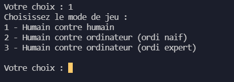
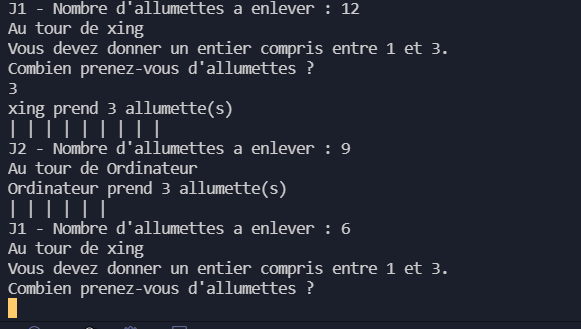

# Jeu d'allumettes

Jeu d'allumettes réalisé dans le cadre du TP en language de programmation C.

## Auteurs 

[Xing CHEN](https://github.com/xingcdev)

[Antoine DESPRES](https://github.com/antoinedespres)

## Fonctionnalités

- 3 modes : 
    - humain contre humain 
    - humain contre ordinateur naïf
    - humain contre ordinateur expert 

- Deux joueurs qui, à tour de rôle, prennent 1, 2 ou 3 allumettes d’un tas de 30 allumettes.

- Un joueur doit retirer entre 1 et 3 allumettes, sinon le coup  est refusé et le joueur doit rejouer.

- Le joueur qui prend la dernière allumette perd.

## Usage

Saisissez un nombre correspondant dans le menu :

1- Jouer \
2 - Voir les règles du jeu \
3 - Voir les crédits \
4 - Quitter


Puis choisissez un mode parmi les 3 suivants : 



- humain contre humain
 
    Le joueur 1 et le joueur 2 saisissent, chacun leur tour, un nombre d'allumettes à jouer.

- humain contre ordinateur naïf
 
    L’ordinateur choisit aléatoirement le nombre d’allumettes à jouer
 
- humain contre ordinateur expert

    L’ordinateur joue du mieux qu’il peut (s’il peut gagner, il gagnera)

Enjoy !



## Comment fonctionne le programme

Une boucle s'exécute tant qu'il reste au moins une allumette à retirer.
À chaque saisie d'un nombre d'allumettes, le programme vérifie sa validité et demande au joueur de recommencer en cas de saisie incorrecte. À chaque tour, le programme alterne entre le joueur 1 et le joueur 2 (qu'il soit humain ou l'ordinateur).

S'il s'agit de l'ordinateur, celui-ci retire aléatoirement entre 1 et 3 allumettes lorsqu'il est en mode naïf. En revanche, lorsqu'il est en mode expert, celui-ci fait en sorte que le nombre d'allumettes restant soit congru à 1 modulo 4 (c'est-à-dire un multiple de 4 auquel on ajoute 1). De cette manière, l'ordinateur joue du mieux qu’il peut.

## Ce que l'on a appris 

### Copier un string dans un tableau 

```c
// Mettre "Ordinateur " en tant que premier élement du tableau
char nomsJoueurs[20];
strcpy(nomsJoueurs[1], "Ordinateur");
```

### `gets()` ne fonctionne pas 

Ajouter `getchar()` avant `gets()`.

```c
char saisie[20];
getchar(); 
fflush(stdin);
gets(saisie);
```

### Créer un joueur robot

[Comment gagner au jeu d'allumettes](http://maths.amatheurs.fr/index.php?page=allumettes)


